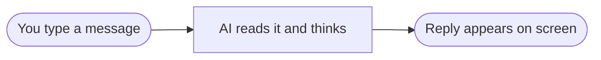
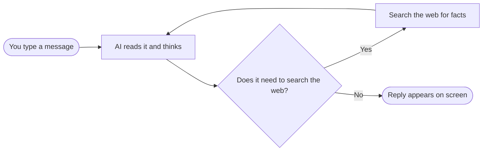
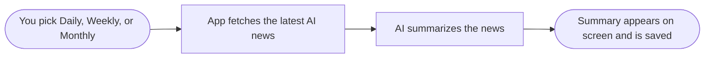

<div align="center">

# AI Chatbot

A simple AI chatbot web app with three modes: an everyday chatbot, a chatbot that can search the internet, and a tool that reads and summarizes the latest AI news for you. It runs in your browser and is easy to try out yourself.

## What This App Uses

| Tool | Job in this project |
| --- | --- |
| **Python** | The programming language the app is written in |
| **Streamlit** | Turns the code into the chat website you see in your browser |
| **LangGraph** | Connects the steps of each feature together, like a flowchart |
| **Groq** | The AI "brain" that reads your messages and writes replies (very fast) |
| **Tavily** | Searches the internet for real-time facts and news |
| **python-dotenv** | Keeps your API keys safely outside the code |

</div>

## The Three Features

You pick one of these from the sidebar when the app opens.

### 1. Basic Chatbot

A straightforward AI chat. You type a message, the AI replies. No internet search, just conversation.



### 2. Chatbot With Tool

Same as the basic chat, but this AI is allowed to search the web whenever it needs current information, then uses what it finds to give you a proper answer.



### 3. AI News

Pick a time frame — Daily, Weekly, or Monthly — and the app fetches the latest AI news, summarizes it in plain language, and saves a copy for you to read again later.



## Run It Yourself

### Step 1 — Get the code

Download or clone this project folder to your computer.

### Step 2 — Install Python

Make sure [Python 3.13](https://www.python.org/downloads/) is installed.

### Step 3 — Set up the project

Open a terminal in the project folder and run:

```powershell
# Create a virtual environment
python -m venv .venv

# Activate it (Windows)
.venv\Scripts\activate

# Activate it (Mac/Linux) - use this line instead
# source .venv/bin/activate

# Install everything the app needs
pip install -r requirements.txt
```

### Step 4 — Get your free API keys

This app needs a "key" to talk to the AI. Two are used:

- **Groq key** (needed for every feature) — get one free at [console.groq.com/keys](https://console.groq.com/keys)
- **Tavily key** (needed only for "Chatbot With Tool" and "AI News") — get one free at [app.tavily.com](https://app.tavily.com/home)

### Step 5 — Add your keys

Pick whichever is easier for you:

- **Easiest:** just start the app (Step 6) and paste your keys into the boxes in the sidebar.
- **Or save them once:** copy `.env.example` to a new file named `.env`, then paste your keys in next to `GROQ_API_KEY` and `TAVILY_API_KEY`.

### Step 6 — Start the app

```powershell
streamlit run app.py
```

Your browser will open automatically. Pick a feature from the sidebar and start chatting.
